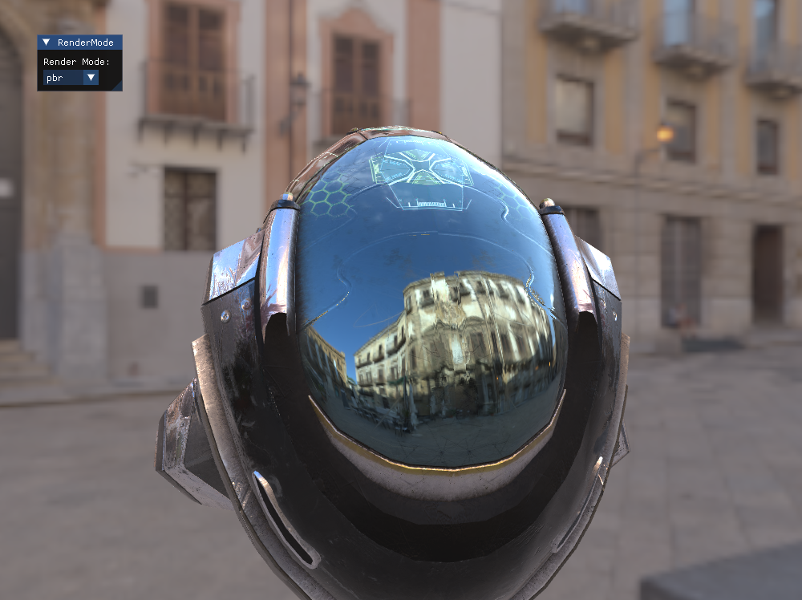

# Glow

A (WIP) Physically Based 3D Model Renderer.

## Demo



## Build

On Windows with vcpkg installed

```sh
mkdir build
cd build
cmake ..
# run demo scene with:

./glow.exe
```
I have not tested on other platforms

## Features

1. Image based Lighting and Metallic-Roughness Workflow.
2. CPU View Frustum Culling.
3. Bounding Box Debug View.

## Reference

[Learn OpenGL: PBR](https://learnopengl.com/PBR/Theory)

[3D Graphics Rendering Cookbook](https://github.com/PacktPublishing/3D-Graphics-Rendering-Cookbook)